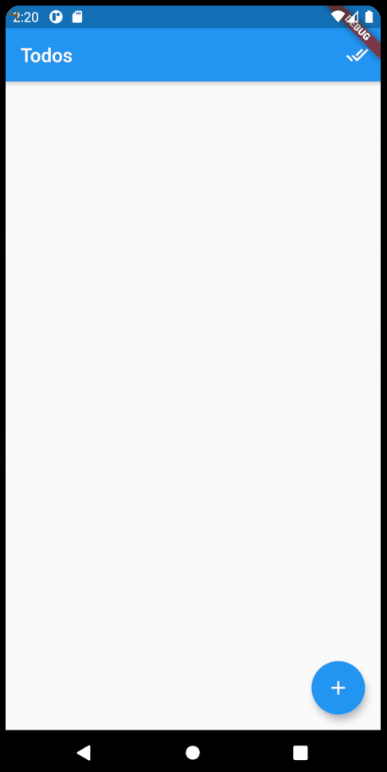

# Todo App

A simple App to keep track of your daily tasks, written in Flutter using the Hive database.

Tested on Android, Web and Windows (desktop). 

## How to run the app

On the root directory of the repository, run `flutter run` and choose your prefered platform.